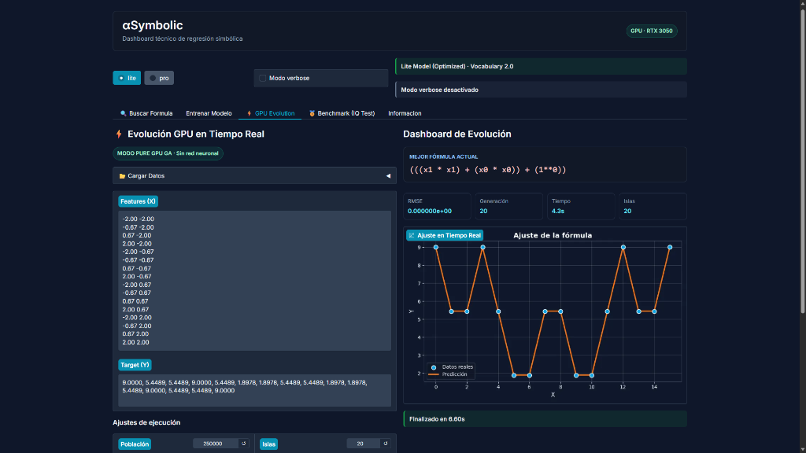

# Formula Genetica / Genetic Formula

> **Symbolic Regression** with Genetic Programming, Neuro-Symbolic Search, and CUDA/GPU Acceleration.
> **Regresión Simbólica** con Programación Genética, Búsqueda Neuro-Simbólica y Aceleración CUDA/GPU.

[](LICENSE)
[](https://isocpp.org/)
[](https://developer.nvidia.com/cuda-toolkit)
[](https://www.openmp.org/)
[](https://www.python.org/)

---

## 🇺🇸 English Version

### Project Status

> [!NOTE]
> This is an **early-stage open-source research and educational project**. It is designed to explore symbolic regression architectures, GPU-accelerated evolutionary engines, and neuro-symbolic integrations. We focus strictly on performance and architectural exploration.

This repository features two complementary implementations to discover mathematical formulas from numerical data:

- `AlphaSymbolic/`: A Python/Gradio application with PyTorch, hybrid search (Beam Search, MCTS), a GPU tensor genetic engine, and a native CUDA extension.
- `Code/`: A C++17 engine featuring CUDA/OpenMP acceleration, island migration models, genetic operators, and a test suite.

---

### Why This Project Matters

Standard symbolic regression tools (e.g., PySR, Operon, gplearn) are typically CPU-bound or have limited GPU support. High-performance evaluation is key to scaling genetic programming.

This project implements a highly optimized **GPU-accelerated tensor genetic engine** directly in PyTorch and native CUDA. By evaluating expression trees in Reverse Polish Notation (RPN) directly on GPU arrays, we bypass Python overhead and achieve **over 21 million formula evaluations per second** on consumer laptop hardware (NVIDIA RTX 3050 Laptop). 

Additionally, this repo explores **neuro-symbolic search**—combining neural autoregressive transformers with traditional genetic algorithms, Monte Carlo Tree Search (MCTS), and Particle Swarm Optimization (PSO) to guide constant optimization.

---

### Real-World Example: N-Queens Solver (OEIS A000170)

The engine is pre-configured to search for formulas approximating the number of solutions to the **N-Queens problem** (OEIS sequence A000170) using $x_0 = n$, $x_1 = n \pmod 6$, and $x_2 = n \pmod 2$ as input features.

#### Input Points & Targets ($X \rightarrow Y$)
For $n$ ranging from $8$ to $24$:
```text
n=8  -> x=(8,  2, 0) -> Y=92
n=9  -> x=(9,  3, 1) -> Y=352
n=10 -> x=(10, 4, 0) -> Y=724
n=11 -> x=(11, 5, 1) -> Y=2680
n=12 -> x=(12, 0, 0) -> Y=14200
...
n=24 -> x=(24, 0, 0) -> Y=2207893435808352
```

#### Found Formula (Log-Space Target Approximation)
An example equation discovered by the GPU evolutionary engine:
$$f(x_0) = \exp\left(\frac{4.02207}{\frac{6}{\text{lgamma}(x_0) - 2.90206}}\right)$$
*Where $\text{lgamma}(x_0)$ is the log-gamma function, approximating the factorial growth of the N-Queens solution space.*

---

### Application Interface & Web UI

The Gradio web interface allows users to define custom datasets, execute searches, monitor populations in real time, and train candidate models.



---

### Execution Logs (Console)

Here is a sample execution log from the console search (`python AlphaSymbolic/scripts/run_gpu_console.py`):

```text
Starting Genetic Algorithm (GPU Mode)...
GPU: NVIDIA GeForce RTX 3050 Laptop GPU
Loading configuration...
Config loaded: POP_SIZE=1000000, NUM_ISLANDS=20
[Engine] Precision Mode: torch.float32
Evaluating initial population...
[GPU Engine] Initializing fresh population (structural basis + random)...
[Engine] Population Initialized: 1000000 Random (Pure GP).

========================================
New Global Best Found (Gen 1, Island 7)
Fitness: 0.76497918
Size: 8
Formula: (3.8776927 / (6 / (lgamma(x0) - 1)))
========================================

--- Gen 1 (Elapsed: 0.23s) | Instant Speed: 4,330,941 Evals/sec ---
Overall Best Fitness: 7.6498e-01
Best Formula Size: 8

--- Gen 2 (Elapsed: 0.44s) | Instant Speed: 4,839,557 Evals/sec ---
Overall Best Fitness: 7.6498e-01

========================================
New Global Best Found (Gen 3, Island 16)
Fitness: 0.46344391
Size: 10
Formula: lgamma((x0 / (e / (2 * (5**0)))))
========================================

--- Gen 3 (Elapsed: 0.49s) | Instant Speed: 18,378,498 Evals/sec ---
Overall Best Fitness: 4.6344e-01

========================================
New Global Best Found (Gen 4, Island 7)
Fitness: 0.33555275
Size: 8
Formula: (4.02207422 / (6 / (lgamma(x0) - 2.90206075)))
========================================

--- Gen 5 (Elapsed: 0.60s) | Instant Speed: 21,517,196 Evals/sec ---
Overall Best Fitness: 3.3555e-01
Best Formula Size: 8
[STRICT] Formula valid: all 17 points pass strict math

Search Finished.
Final Result: exp((4.02207422 / (6 / (lgamma(x0) - 2.90206075))))
```

---

### Project Roadmap

We plan to implement the following milestones in upcoming releases:

1. **GPU Optimization**: Fuse additional operators (power, modulus, trigonometric functions) directly into custom CUDA RPN kernels, and minimize VRAM allocations for larger populations.
2. **Testing Suite Expansion**: Implement a Python-level testing framework (using `pytest`) covering the GPU engine wrappers, RPN tokenization, and CUDA interface boundaries.
3. **Feynman Benchmark Integration**: Automatically evaluate search performance against standard Feynman and Keijzer benchmark datasets, providing direct R2 and runtime comparisons with PySR and Operon.
4. **API and Mathematical Documentation**: Publish mathematical explanations for our adaptive migration frequency, Constant Perturbation Mutation, and Particle Swarm Optimization algorithms.
5. **Examples & Tutorials**: Add Jupyter Notebooks demonstrating symbolic regression on custom tabular data (CSVs), showcasing constants optimization and custom domain constraints.

---

### Getting Started

#### Python / AlphaSymbolic Setup
1. Install dependencies:
   ```powershell
   cd AlphaSymbolic
   pip install -r requirements.txt
   ```
2. Start the web application:
   ```powershell
   python app.py
   ```
3. Or run the console search script:
   ```powershell
   python scripts/run_gpu_console.py
   ```

#### C++ / Code Setup
1. Build with CMake (requires compilers supporting C++17, OpenMP, and optionally CUDA):
   ```powershell
   cd Code
   cmake -S . -B build -G "Visual Studio 17 2022"
   cmake --build build --config Debug
   ```
2. Run operators test suite:
   ```powershell
   cd Code
   .\scripts\run_tests.bat
   ```

---

## 🇪🇸 Versión en Español

### Estado del Proyecto

> [!NOTE]
> Este es un **proyecto educativo y de investigación de código abierto en etapa temprana**. Está diseñado para explorar arquitecturas de regresión simbólica, motores evolutivos acelerados por GPU e integraciones neuro-simbólicas. Nos enfocamos únicamente en el rendimiento y en la exploración arquitectónica.

Este repositorio contiene dos implementaciones complementarias para descubrir fórmulas matemáticas a partir de datos numéricos:

- `AlphaSymbolic/`: Aplicación Python/Gradio con PyTorch, búsqueda híbrida (Beam Search, MCTS), un motor genético de tensores en GPU y extensión CUDA nativa.
- `Code/`: Motor C++17 que incluye aceleración CUDA/OpenMP, modelo de migración por islas, operadores genéticos y suite de pruebas.

---

### Por qué importa este proyecto

Las herramientas estándar de regresión simbólica (como PySR, Operon, gplearn) suelen estar limitadas a la CPU o tienen un soporte limitado para GPU. La evaluación de alto rendimiento es clave para escalar la programación genética.

Este proyecto implementa un **motor genético tensorial acelerado por GPU** altamente optimizado directamente en PyTorch y CUDA nativo. Al evaluar los árboles de expresiones en notación polaca inversa (RPN) directamente sobre tensores de GPU, evitamos la sobrecarga de Python y logramos **más de 21 millones de evaluaciones de fórmulas por segundo** en hardware de consumo común (NVIDIA RTX 3050 Laptop).

Además, el repositorio explora la **búsqueda neuro-simbólica**, combinando transformadores neuronales autorregresivos con algoritmos genéticos tradicionales, Búsqueda de Árboles de Monte Carlo (MCTS) y Optimización por Enjambre de Partículas (PSO) para guiar la optimización de constantes.

---

### Ejemplo Real: Solucionador de N-Reinas (OEIS A000170)

El motor está preconfigurado para buscar fórmulas que aproximen el número de soluciones del **problema de las N-Reinas** (secuencia OEIS A000170) utilizando $x_0 = n$, $x_1 = n \pmod 6$, y $x_2 = n \pmod 2$ como variables de entrada.

#### Puntos de Entrada y Objetivos ($X \rightarrow Y$)
Para $n$ en el rango de $8$ a $24$:
```text
n=8  -> x=(8,  2, 0) -> Y=92
n=9  -> x=(9,  3, 1) -> Y=352
n=10 -> x=(10, 4, 0) -> Y=724
n=11 -> x=(11, 5, 1) -> Y=2680
n=12 -> x=(12, 0, 0) -> Y=14200
...
n=24 -> x=(24, 0, 0) -> Y=2207893435808352
```

#### Fórmula Encontrada (Aproximación del Objetivo en Espacio Logarítmico)
Una ecuación de ejemplo descubierta por el motor evolutivo en GPU:
$$f(x_0) = \exp\left(\frac{4.02207}{\frac{6}{\text{lgamma}(x_0) - 2.90206}}\right)$$
*Donde $\text{lgamma}(x_0)$ es la función log-gamma, que aproxima el crecimiento factorial del espacio de soluciones de N-Reinas.*

---

### Interfaz de la Aplicación y UI Web

La interfaz web en Gradio permite a los usuarios definir conjuntos de datos personalizados, ejecutar búsquedas, monitorear poblaciones en tiempo real y entrenar modelos candidatos.


---

### Logs de Ejecución (Consola)

A continuación se muestra un log de ejecución de la búsqueda en consola (`python AlphaSymbolic/scripts/run_gpu_console.py`):

```text
Starting Genetic Algorithm (GPU Mode)...
GPU: NVIDIA GeForce RTX 3050 Laptop GPU
Loading configuration...
Config loaded: POP_SIZE=1000000, NUM_ISLANDS=20
[Engine] Precision Mode: torch.float32
Evaluating initial population...
[GPU Engine] Initializing fresh population (structural basis + random)...
[Engine] Population Initialized: 1000000 Random (Pure GP).

========================================
New Global Best Found (Gen 1, Island 7)
Fitness: 0.76497918
Size: 8
Formula: (3.8776927 / (6 / (lgamma(x0) - 1)))
========================================

--- Gen 1 (Elapsed: 0.23s) | Instant Speed: 4,330,941 Evals/sec ---
Overall Best Fitness: 7.6498e-01
Best Formula Size: 8

--- Gen 2 (Elapsed: 0.44s) | Instant Speed: 4,839,557 Evals/sec ---
Overall Best Fitness: 7.6498e-01

========================================
New Global Best Found (Gen 3, Island 16)
Fitness: 0.46344391
Size: 10
Formula: lgamma((x0 / (e / (2 * (5**0)))))
========================================

--- Gen 3 (Elapsed: 0.49s) | Instant Speed: 18,378,498 Evals/sec ---
Overall Best Fitness: 4.6344e-01

========================================
New Global Best Found (Gen 4, Island 7)
Fitness: 0.33555275
Size: 8
Formula: (4.02207422 / (6 / (lgamma(x0) - 2.90206075)))
========================================

--- Gen 5 (Elapsed: 0.60s) | Instant Speed: 21,517,196 Evals/sec ---
Overall Best Fitness: 3.3555e-01
Best Formula Size: 8
[STRICT] Formula valid: all 17 points pass strict math

Search Finished.
Final Result: exp((4.02207422 / (6 / (lgamma(x0) - 2.90206075))))
```

---

### Roadmap del Proyecto

Planeamos implementar los siguientes hitos en futuras versiones:

1. **Optimización de GPU**: Fusionar operadores adicionales (potencia, módulo, trigonométricas) directamente en los kernels CUDA RPN personalizados, y minimizar las asignaciones de VRAM para poblaciones más grandes.
2. **Expansión de la Suite de Pruebas**: Implementar un framework de pruebas en Python (usando `pytest`) que cubra los wrappers del motor GPU, la tokenización RPN y las fronteras de la interfaz CUDA.
3. **Integración del Benchmark de Feynman**: Evaluar automáticamente el rendimiento de la búsqueda contra los conjuntos de datos Feynman y Keijzer, proporcionando comparaciones directas de R2 y tiempo de ejecución contra PySR y Operon.
4. **Documentación Matemática y API**: Publicar explicaciones matemáticas detalladas para nuestros algoritmos de migración adaptativa por islas, mutación por perturbación de constantes y optimización por enjambre de partículas (PSO).
5. **Ejemplos y Tutoriales**: Añadir notebooks de Jupyter que demuestren la regresión simbólica en datos tabulares personalizados (CSVs), mostrando la optimización de constantes y restricciones de dominio personalizadas.

---

### Primeros Pasos

#### Configuración de Python / AlphaSymbolic
1. Instalar dependencias:
   ```powershell
   cd AlphaSymbolic
   pip install -r requirements.txt
   ```
2. Iniciar la aplicación web:
   ```powershell
   python app.py
   ```
3. O ejecutar el script de búsqueda por consola:
   ```powershell
   python scripts/run_gpu_console.py
   ```

#### Configuración de C++ / Code
1. Compilar con CMake (requiere compiladores compatibles con C++17, OpenMP, y opcionalmente CUDA):
   ```powershell
   cd Code
   cmake -S . -B build -G "Visual Studio 17 2022"
   cmake --build build --config Debug
   ```
2. Ejecutar la suite de pruebas de operadores:
   ```powershell
   cd Code
   .\scripts\run_tests.bat
   ```

---

Copyright 2026 Juan Manuel Pena Usuga. Licensed under the [Apache License 2.0](LICENSE).
