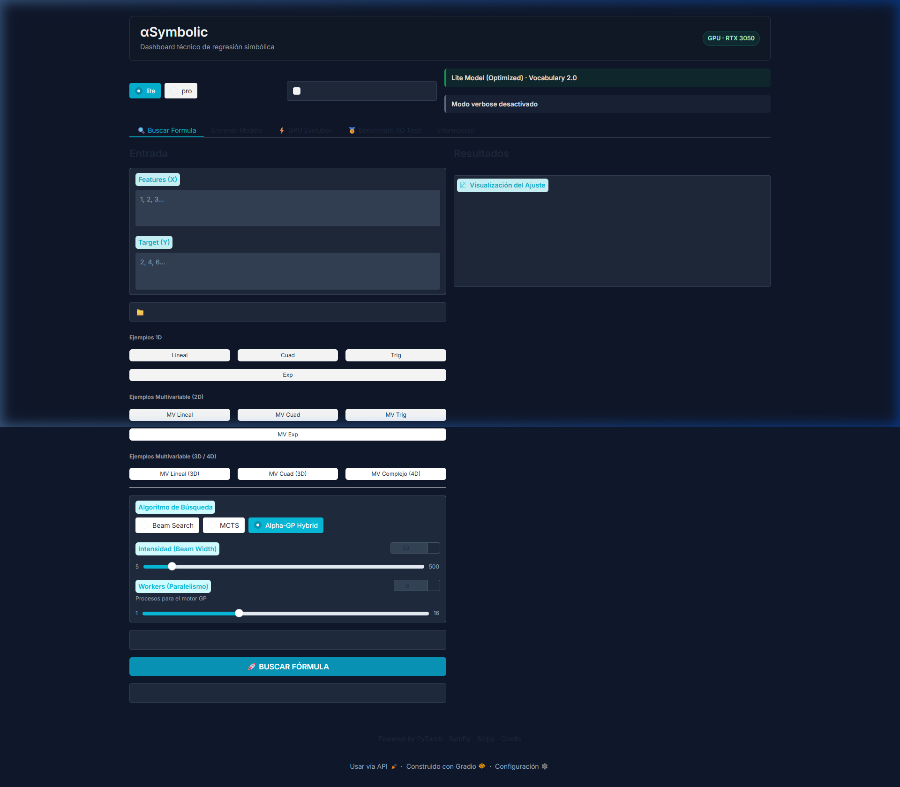

# Formula Genetica / Genetic Formula

> **Symbolic Regression** with Genetic Programming, Neuro-Symbolic Search, and CUDA/GPU Acceleration.
> **Regresión Simbólica** con Programación Genética, Búsqueda Neuro-Simbólica y Aceleración CUDA/GPU.

[](LICENSE)
[](https://isocpp.org/)
[](https://developer.nvidia.com/cuda-toolkit)
[](https://www.openmp.org/)
[](https://www.python.org/)

---

## 🇺🇸 English Version

### Project Status

> [!NOTE]
> This is an **early-stage open-source research and educational project**. It is designed to explore symbolic regression architectures, GPU-accelerated evolutionary engines, and neuro-symbolic integrations. We focus strictly on performance and architectural exploration.

This repository features two complementary implementations to discover mathematical formulas from numerical data:

- `AlphaSymbolic/`: A Python/Gradio application with PyTorch, hybrid search (Beam Search, MCTS), a GPU tensor genetic engine, and a native CUDA extension.
- `Code/`: A C++17 engine featuring CUDA/OpenMP acceleration, island migration models, genetic operators, and a test suite.

The candidate universal API is `AlphaSymbolicRegressor(search_mode="adaptive", max_time=60, target_transform="auto")`. It exposes `formula_`, `sympy_formula_`, `pareto_front_`, `search_report_`, fold scores, MDL, complexity, elapsed budget and a frozen configuration hash. `search_mode="legacy"` remains the default until the documented development, 24×30 and upstream SRBench gates all pass; therefore this repository does **not** currently claim SOTA.

---

### Why This Project Matters

Standard symbolic regression tools (e.g., PySR, Operon, gplearn) are typically CPU-bound or have limited GPU support. High-performance evaluation is key to scaling genetic programming.

This project implements a **GPU-accelerated tensor genetic engine** directly in PyTorch and native CUDA. By evaluating expression trees in Reverse Polish Notation (RPN) on GPU arrays, it reduces Python overhead. A controlled audit on an NVIDIA RTX 3050 Laptop measured a hot median of **26.43 million candidate-generations/s**, up from 25.76 million on the audited baseline. This internal workload metric is not directly comparable to point-wise GPops/s reported by other systems.

See the [July 2026 GPU engine audit](docs/GPU_ENGINE_AUDIT_2026-07-26.md) for the protocol, raw measurements, scientific holdouts, safety fixes, and the remaining work required before making any SOTA claim.

Additionally, this repo explores **neuro-symbolic search**—combining neural autoregressive transformers with traditional genetic algorithms, Monte Carlo Tree Search (MCTS), and Particle Swarm Optimization (PSO) to guide constant optimization.

---

### Clean N-Queens Count-Sequence Evaluation

The isolated evaluation trains the same universal estimator with one input only, $x_0=n$, on $n=8\ldots24$ and holds out $n=25\ldots27$. It does not receive residues, parity, a manual target transform, the sequence identity, a target formula, or test values. Generic `gamma`, `lgamma`, factorial and modulo operators are available to the same grammar bandit for every dataset. This is count-sequence extrapolation, not a board solver or a mathematical proof.

#### Input Points & Targets ($X \rightarrow Y$)
For $n$ ranging from $8$ to $24$:
```text
n=8  -> x=(8)  -> Y=92
n=9  -> x=(9)  -> Y=352
n=10 -> x=(10) -> Y=724
n=11 -> x=(11) -> Y=2680
n=12 -> x=(12) -> Y=14200
...
n=24 -> x=(24) -> Y=227514171973736
```

Results are generated by `benchmark_scientific.py --suite nqueens`; no example formula is hard-coded in the engine or documentation.

---

### Application Interface & Web UI

The Gradio web interface allows users to define custom datasets, execute searches, monitor populations in real time, and train candidate models.



---

### Execution Logs (Console)

The following is a historical legacy-engine trace. The production console now accepts a CSV and calls `AlphaSymbolicRegressor`, exactly like the main web and SRBench paths.

```text
Starting Genetic Algorithm (GPU Mode)...
GPU: NVIDIA GeForce RTX 3050 Laptop GPU
Loading configuration...
Config loaded: POP_SIZE=1000000, NUM_ISLANDS=20
[Engine] Precision Mode: torch.float32
Evaluating initial population...
[GPU Engine] Initializing fresh population (structural basis + random)...
[Engine] Population Initialized: 1000000 Random (Pure GP).

========================================
New Global Best Found (Gen 1, Island 7)
Fitness: 0.76497918
Size: 8
Formula: (3.8776927 / (6 / (lgamma(x0) - 1)))
========================================

--- Gen 1 (Elapsed: 0.23s) | Instant Speed: 4,330,941 Evals/sec ---
Overall Best Fitness: 7.6498e-01
Best Formula Size: 8

--- Gen 2 (Elapsed: 0.44s) | Instant Speed: 4,839,557 Evals/sec ---
Overall Best Fitness: 7.6498e-01

========================================
New Global Best Found (Gen 3, Island 16)
Fitness: 0.46344391
Size: 10
Formula: lgamma((x0 / (e / (2 * (5**0)))))
========================================

--- Gen 3 (Elapsed: 0.49s) | Instant Speed: 18,378,498 Evals/sec ---
Overall Best Fitness: 4.6344e-01

========================================
New Global Best Found (Gen 4, Island 7)
Fitness: 0.33555275
Size: 8
Formula: (4.02207422 / (6 / (lgamma(x0) - 2.90206075)))
========================================

--- Gen 5 (Elapsed: 0.60s) | Instant Speed: 21,517,196 Evals/sec ---
Overall Best Fitness: 3.3555e-01
Best Formula Size: 8
[STRICT] Formula valid: all 17 points pass strict math

Search Finished.
Final Result: exp((4.02207422 / (6 / (lgamma(x0) - 2.90206075))))
```

---

### Project Roadmap

We plan to implement the following milestones in upcoming releases:

1. **GPU Optimization**: Fuse additional operators (power, modulus, trigonometric functions) directly into custom CUDA RPN kernels, and minimize VRAM allocations for larger populations.
2. **Testing Suite Expansion**: Implement a Python-level testing framework (using `pytest`) covering the GPU engine wrappers, RPN tokenization, and CUDA interface boundaries.
3. **SRBench Upstream Validation**: The pinned, resumable SRBench 2025 harness and sklearn/SymPy adapter are implemented. The next milestone is acceptance and matched tuning inside the upstream orchestrator.
4. **API and Mathematical Documentation**: Publish mathematical explanations for our adaptive migration frequency, Constant Perturbation Mutation, and Particle Swarm Optimization algorithms.
5. **Examples & Tutorials**: Add Jupyter Notebooks demonstrating symbolic regression on custom tabular data (CSVs), showcasing constants optimization and custom domain constraints.

---

### Getting Started

#### Python / AlphaSymbolic Setup
1. Install dependencies:
   ```powershell
   pip install -e ".[benchmark]"
   ```
2. Start the web application:
   ```powershell
   python AlphaSymbolic/app.py
   ```
3. Or run the console search script:
   ```powershell
   python AlphaSymbolic/scripts/run_gpu_console.py data.csv --target y
   ```
4. Run the independent scientific holdout suite:
   ```powershell
   python AlphaSymbolic/scripts/benchmark_scientific.py --suite development --mode both
   python AlphaSymbolic/scripts/benchmark_scientific.py --suite nqueens --mode adaptive --seeds 30
   python AlphaSymbolic/scripts/freeze_adaptive_config.py benchmarks/adaptive_config.json
   ```
5. Verify the SRBench integration, then run a profile:
   ```powershell
   python -m AlphaSymbolic.scripts.benchmark_srbench --help
   python -m AlphaSymbolic.scripts.benchmark_srbench --profile quick --resume
   ```

   See the [pinned SRBench 2025 reproducibility guide](docs/SRBENCH_REPRODUCIBILITY.md) before interpreting or publishing a rank.

#### C++ / Code Setup
1. Build with CMake (requires compilers supporting C++17, OpenMP, and optionally CUDA):
   ```powershell
   cd Code
   cmake -S . -B build -G "Visual Studio 17 2022"
   cmake --build build --config Debug
   ```
2. Run operators test suite:
   ```powershell
   cd Code
   .\scripts\run_tests.bat
   ```

---

## 🇪🇸 Versión en Español

### Estado del Proyecto

> [!NOTE]
> Este es un **proyecto educativo y de investigación de código abierto en etapa temprana**. Está diseñado para explorar arquitecturas de regresión simbólica, motores evolutivos acelerados por GPU e integraciones neuro-simbólicas. Nos enfocamos únicamente en el rendimiento y en la exploración arquitectónica.

Este repositorio contiene dos implementaciones complementarias para descubrir fórmulas matemáticas a partir de datos numéricos:

- `AlphaSymbolic/`: Aplicación Python/Gradio con PyTorch, búsqueda híbrida (Beam Search, MCTS), un motor genético de tensores en GPU y extensión CUDA nativa.
- `Code/`: Motor C++17 que incluye aceleración CUDA/OpenMP, modelo de migración por islas, operadores genéticos y suite de pruebas.

La API universal candidata es `AlphaSymbolicRegressor(search_mode="adaptive", max_time=60, target_transform="auto")`. Expone `formula_`, `sympy_formula_`, `pareto_front_`, `search_report_`, scores por fold, MDL, complejidad, presupuesto consumido y hash de configuración. `search_mode="legacy"` continúa como valor predeterminado hasta superar todos los gates de desarrollo, 24×30 y SRBench upstream; por eso el repositorio **todavía no** afirma ser SOTA.

---

### Por qué importa este proyecto

Las herramientas estándar de regresión simbólica (como PySR, Operon, gplearn) suelen estar limitadas a la CPU o tienen un soporte limitado para GPU. La evaluación de alto rendimiento es clave para escalar la programación genética.

Este proyecto implementa un **motor genético tensorial acelerado por GPU** directamente en PyTorch y CUDA nativo. Al evaluar los árboles de expresiones en notación polaca inversa (RPN) sobre tensores GPU, reduce la sobrecarga de Python. Una auditoría controlada en una NVIDIA RTX 3050 Laptop midió una mediana caliente de **26,43 millones de candidatos-generación/s**, frente a 25,76 millones en la línea base auditada. Esta métrica interna no es directamente comparable con los GPops/s por punto publicados por otros sistemas.

Consulta la [auditoría del motor GPU de julio de 2026](docs/GPU_ENGINE_AUDIT_2026-07-26.md) para ver el protocolo, las mediciones crudas, los holdouts científicos, las correcciones de seguridad y lo que aún falta antes de afirmar SOTA.

Además, el repositorio explora la **búsqueda neuro-simbólica**, combinando transformadores neuronales autorregresivos con algoritmos genéticos tradicionales, Búsqueda de Árboles de Monte Carlo (MCTS) y Optimización por Enjambre de Partículas (PSO) para guiar la optimización de constantes.

---

### Evaluación limpia de la secuencia de conteos de N‑reinas

La evaluación aislada entrena el mismo estimador universal con una sola entrada, $x_0=n$, usando $n=8\ldots24$ y reserva $n=25\ldots27$. No recibe residuos, paridad, una transformación manual del objetivo, identidad de la secuencia, fórmula objetivo ni valores de test. Los operadores genéricos `gamma`, `lgamma`, factorial y módulo están disponibles para el mismo bandit de gramáticas en todos los conjuntos de datos. Es extrapolación de conteos, no un solver de tableros ni una prueba matemática.

#### Puntos de Entrada y Objetivos ($X \rightarrow Y$)
Para $n$ en el rango de $8$ a $24$:
```text
n=8  -> x=(8)  -> Y=92
n=9  -> x=(9)  -> Y=352
n=10 -> x=(10) -> Y=724
n=11 -> x=(11) -> Y=2680
n=12 -> x=(12) -> Y=14200
...
n=24 -> x=(24) -> Y=227514171973736
```

Los resultados se generan con `benchmark_scientific.py --suite nqueens`; no hay una fórmula de ejemplo codificada en el motor ni en la documentación.

---

### Interfaz de la Aplicación y UI Web

La interfaz web en Gradio permite a los usuarios definir conjuntos de datos personalizados, ejecutar búsquedas, monitorear poblaciones en tiempo real y entrenar modelos candidatos.


---

### Logs de Ejecución (Consola)

El siguiente es un rastro histórico del motor legado. La consola de producción ahora recibe un CSV y llama a `AlphaSymbolicRegressor`, igual que la web principal y SRBench.

```text
Starting Genetic Algorithm (GPU Mode)...
GPU: NVIDIA GeForce RTX 3050 Laptop GPU
Loading configuration...
Config loaded: POP_SIZE=1000000, NUM_ISLANDS=20
[Engine] Precision Mode: torch.float32
Evaluating initial population...
[GPU Engine] Initializing fresh population (structural basis + random)...
[Engine] Population Initialized: 1000000 Random (Pure GP).

========================================
New Global Best Found (Gen 1, Island 7)
Fitness: 0.76497918
Size: 8
Formula: (3.8776927 / (6 / (lgamma(x0) - 1)))
========================================

--- Gen 1 (Elapsed: 0.23s) | Instant Speed: 4,330,941 Evals/sec ---
Overall Best Fitness: 7.6498e-01
Best Formula Size: 8

--- Gen 2 (Elapsed: 0.44s) | Instant Speed: 4,839,557 Evals/sec ---
Overall Best Fitness: 7.6498e-01

========================================
New Global Best Found (Gen 3, Island 16)
Fitness: 0.46344391
Size: 10
Formula: lgamma((x0 / (e / (2 * (5**0)))))
========================================

--- Gen 3 (Elapsed: 0.49s) | Instant Speed: 18,378,498 Evals/sec ---
Overall Best Fitness: 4.6344e-01

========================================
New Global Best Found (Gen 4, Island 7)
Fitness: 0.33555275
Size: 8
Formula: (4.02207422 / (6 / (lgamma(x0) - 2.90206075)))
========================================

--- Gen 5 (Elapsed: 0.60s) | Instant Speed: 21,517,196 Evals/sec ---
Overall Best Fitness: 3.3555e-01
Best Formula Size: 8
[STRICT] Formula valid: all 17 points pass strict math

Search Finished.
Final Result: exp((4.02207422 / (6 / (lgamma(x0) - 2.90206075))))
```

---

### Roadmap del Proyecto

Planeamos implementar los siguientes hitos en futuras versiones:

1. **Optimización de GPU**: Fusionar operadores adicionales (potencia, módulo, trigonométricas) directamente en los kernels CUDA RPN personalizados, y minimizar las asignaciones de VRAM para poblaciones más grandes.
2. **Expansión de la Suite de Pruebas**: Implementar un framework de pruebas en Python (usando `pytest`) que cubra los wrappers del motor GPU, la tokenización RPN y las fronteras de la interfaz CUDA.
3. **Validación upstream en SRBench**: El harness SRBench 2025 fijado y reanudable, junto con el adaptador sklearn/SymPy, ya están implementados. El siguiente hito es su aceptación y tuning equivalente dentro del orquestador upstream.
4. **Documentación Matemática y API**: Publicar explicaciones matemáticas detalladas para nuestros algoritmos de migración adaptativa por islas, mutación por perturbación de constantes y optimización por enjambre de partículas (PSO).
5. **Ejemplos y Tutoriales**: Añadir notebooks de Jupyter que demuestren la regresión simbólica en datos tabulares personalizados (CSVs), mostrando la optimización de constantes y restricciones de dominio personalizadas.

---

### Primeros Pasos

#### Configuración de Python / AlphaSymbolic
1. Instalar dependencias:
   ```powershell
   pip install -e ".[benchmark]"
   ```
2. Iniciar la aplicación web:
   ```powershell
   python AlphaSymbolic/app.py
   ```
3. O ejecutar el script de búsqueda por consola:
   ```powershell
   python AlphaSymbolic/scripts/run_gpu_console.py datos.csv --target y
   ```
4. Ejecutar el holdout científico independiente:
   ```powershell
   python AlphaSymbolic/scripts/benchmark_scientific.py --suite development --mode both
   python AlphaSymbolic/scripts/benchmark_scientific.py --suite nqueens --mode adaptive --seeds 30
   python AlphaSymbolic/scripts/freeze_adaptive_config.py benchmarks/adaptive_config.json
   ```
5. Verificar la integración SRBench y ejecutar un perfil:
   ```powershell
   python -m AlphaSymbolic.scripts.benchmark_srbench --help
   python -m AlphaSymbolic.scripts.benchmark_srbench --profile quick --resume
   ```

   Consulte la [guía de reproducibilidad SRBench 2025 fijada](docs/SRBENCH_REPRODUCIBILITY.md) antes de interpretar o publicar un puesto.

#### Configuración de C++ / Code
1. Compilar con CMake (requiere compiladores compatibles con C++17, OpenMP, y opcionalmente CUDA):
   ```powershell
   cd Code
   cmake -S . -B build -G "Visual Studio 17 2022"
   cmake --build build --config Debug
   ```
2. Ejecutar la suite de pruebas de operadores:
   ```powershell
   cd Code
   .\scripts\run_tests.bat
   ```

---

Copyright 2026 Juan Manuel Pena Usuga. Licensed under the [Apache License 2.0](LICENSE).
